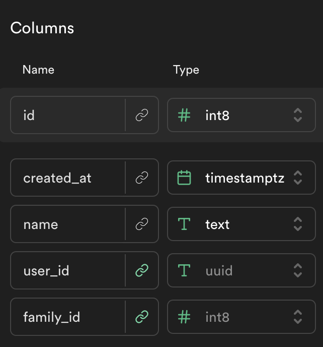
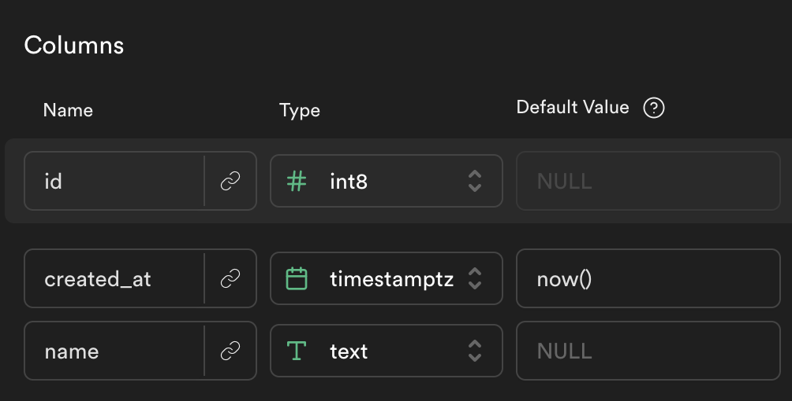

# Supabase Fuzzy Bunny Organizer

## Learning Objectives
- In response to a user event, make a fetch  call to delete an item in the array and display the new state to the user (i.e., delete a todo).

[Buggy Supabase Fuzzy Bunny Organizer](https://github.com/alchemycodelab/buggy-js-fuzzy-bunny-organizer)

Here is the schema for the `fuzzy_bunnies` table

Here is the schema for the `loving_families` table

### Live Example:
https://alchemycodelab.github.io/web-01-fuzzy-bunny-organizer/

### Stretch Goals Ideas
1) Add a page that lets you create a new loving family
2) On click, don't delete the bunny--go to the bunny's "detail page". The detail page will have an interface that lets the user update the bunny. This includes allowing the user to change which loving family the bunny belongs to.
3) Automatically generate the bunny form using a bunny fetched from the database. That way if new properties end up added to the bunny table, the front end dev doesn't need to update the front end later.
4) Add filter/sort functionality to the families page? Only show bunnies who are larger than 7 lbs, for example? Only show families with more than 2 bunnies?
5) _Mega ambitious_: I want to able to drag and drop bunnies to different families.

| User should be able to . . .                                                         |             |
| :----------------------------------------------------------------------------------- | ----------: |
| Visit the deployed pages on GitHub pages, with link in the About section of the Github repo |    .5 |

| Events                                                                                |             |
| :----------------------------------------------------------------------------------- | ----------: |
| On the home page (`'/'`), Login and Signup using the login and signup form. On success, redirect to the `/families` page   |        .5 |
| Logout by clicking the logout button                                                       |        .5 |
| If a non-logged-in user tries to visit the `/families` or `/create` page, redirect them to the login page     |       .5 |
| On the `/families` page load, fetch the families (with their bunnies) from supabase and render them to the page         |        1 |
| On clicking a bunny, delete it from supabase. Clear out all families from the DOM, refetch, and render them again.                                              |        1 |
| On the `/create` page, on load, fetch families. Use these families to create the dropdown to let the user attach a bunny to a family.                            |        1 |
| On the `/create` page, on submit, create a bunny. The form should include a name for the bunny and a dropdown for the family (from the fetched families in supabase).                            |        1 |

| Functions                                                                                |             |
| :----------------------------------------------------------------------------------- | ----------: |
| PURE with TDD: `renderBunny(bunny)` : returns a DOM node the bunny |1|
| ASYNC: `getFamilies()` : get all bunnies in supabase. (These families are the same for everybody in the cohort and do not 'belong' to any particular user. Your bunnies will show up for everybody) |1|
| ASYNC: `createBunny(bunny)` : create bunny in supabase and attach it to a family |1|
| ASYNC: `deleteBunny(id)` : delete a bunny in supabase |1|
